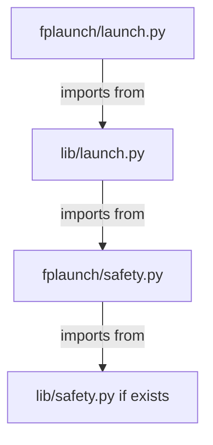

# 🔍 Technical Bug Analysis - fplaunchwrapper

## Detailed Analysis of Critical Issues

### 1. Bare Except Clauses - Detailed Examples and Fixes

#### Example 1: `lib/launch.py` line 18

**Current Code**:
```python
try:
    from python_utils import find_executable
    UTILS_AVAILABLE = True
except:
    UTILS_AVAILABLE = False
```

**Issue**: Catches ALL exceptions including `KeyboardInterrupt`, `MemoryError`, etc.

**Fixed Code**:
```python
try:
    from python_utils import find_executable
    UTILS_AVAILABLE = True
except ImportError:
    UTILS_AVAILABLE = False
```

#### Example 2: `lib/python_utils.py` line 41

**Current Code**:
```python
def is_wrapper_file(file_path) -> bool | None:
    try:
        # Basic validation
        if not os.path.isfile(file_path):
            return False
        if not os.access(file_path, os.R_OK):
            return False
        
        # Read and validate content
        with open(file_path, 'r') as f:
            content = f.read()
            
        return content.startswith('#!')
    except:
        return None
```

**Issue**: Bare except masks file system errors, permission issues, etc.

**Fixed Code**:
```python
def is_wrapper_file(file_path) -> bool | None:
    try:
        # Basic validation
        if not os.path.isfile(file_path):
            return False
        if not os.access(file_path, os.R_OK):
            return False
        
        # Read and validate content
        with open(file_path, 'r') as f:
            content = f.read()
            
        return content.startswith('#!')
    except (IOError, OSError, PermissionError) as e:
        # Log the specific error for debugging
        if hasattr(e, 'errno'):
            print(f"Error checking wrapper file {file_path}: {e}", file=sys.stderr)
        return None
```

### 2. Circular Import Analysis

#### Current Import Chain



#### Problem Scenario

1. User imports `from fplaunch.launch import AppLauncher`
2. This triggers `from lib.launch import *`
3. `lib/launch.py` tries `from fplaunch.safety import safe_launch_check`
4. If `fplaunch.safety` isn't fully loaded yet, this can fail

#### Solution Options

**Option 1: Lazy Import (Recommended)**
```python
# In lib/launch.py
class AppLauncher:
    def __init__(self, *args, **kwargs):
        self._safety_module = None
        # ... rest of init
    
    def _get_safety_module(self):
        if self._safety_module is None:
            try:
                from fplaunch.safety import safe_launch_check
                self._safety_module = safe_launch_check
            except ImportError:
                self._safety_module = lambda *args, **kwargs: True
        return self._safety_module
    
    def launch(self):
        # Use lazy-loaded safety module
        if not self._get_safety_module()(self.app_name, self._find_wrapper()):
            return False
        # ... rest of launch logic
```

**Option 2: Move Safety to Common Module**
```python
# Create lib/safety_common.py with core safety functions
# Both fplaunch/safety.py and lib/launch.py import from this common module
```

### 3. Test Safety Enhancements

#### Current Test Pattern (test_launch_real.py)

```python
wrapper.write_text("#!/bin/bash\necho 'Firefox launched'\nexit 0\n")
wrapper.chmod(0o755)
```

**Issues**:
1. Creates executable files in test environment
2. No validation of wrapper content safety
3. Manual cleanup required

#### Enhanced Test Pattern

```python
def setup_method(self):
    """Set up safe test environment."""
    self.temp_dir = Path(tempfile.mkdtemp(prefix="fplaunch_test_"))
    self.bin_dir = self.temp_dir / "bin"
    self.bin_dir.mkdir(parents=True)
    
    # Use pytest fixture for automatic cleanup
    self._created_files = []

def _create_safe_wrapper(self, name, content="echo 'Safe launch'"):
    """Create a safe wrapper with validation."""
    wrapper = self.bin_dir / name
    
    # Validate content doesn't contain dangerous commands
    dangerous_patterns = [
        "flatpak run", "firefox", "chrome", "chromium",
        "rm -rf", "dd if=", "> /dev/"
    ]
    
    if any(pattern in content for pattern in dangerous_patterns):
        raise ValueError(f"Dangerous content detected in wrapper: {name}")
    
    wrapper.write_text(f"#!/bin/bash\n{content}\nexit 0\n")
    wrapper.chmod(0o755)
    self._created_files.append(wrapper)
    return wrapper

def teardown_method(self):
    """Clean up all test artifacts."""
    for file in self._created_files:
        if file.exists():
            file.chmod(0o644)  # Remove execute permission first
            file.unlink()
    
    if self.temp_dir.exists():
        shutil.rmtree(self.temp_dir, ignore_errors=True)
```

### 4. Error Handling Standardization

#### Current Inconsistent Patterns

```python
# Pattern 1: Return False
def method1():
    try:
        # do something
        return True
    except:
        return False

# Pattern 2: Return None  
def method2():
    try:
        # do something
        return result
    except:
        return None

# Pattern 3: Raise Exception
def method3():
    if error_condition:
        raise ValueError("Error occurred")
```

#### Recommended Standard Pattern

```python
def method1() -> bool:
    """Perform action, return True on success, False on failure."""
    try:
        # do something
        return True
    except Exception as e:
        if self.verbose:
            print(f"Error in method1: {e}", file=sys.stderr)
        return False

def method2() -> Optional[ResultType]:
    """Retrieve data, return result or None on failure."""
    try:
        # get data
        return result
    except Exception as e:
        if self.verbose:
            print(f"Error in method2: {e}", file=sys.stderr)
        return None

def method3() -> None:
    """Critical operation that should fail loudly."""
    if error_condition:
        raise RuntimeError("Critical error: detailed description") from original_exception
```

## 🛠️ Implementation Roadmap

### Phase 1: Critical Fixes (Immediate)

1. **Fix bare except clauses** (2-4 hours)
   - Replace all `except:` with `except Exception:`
   - Add specific exception handling where appropriate
   - Add logging for debugging

2. **Resolve circular imports** (4-6 hours)
   - Implement lazy loading for safety module
   - Test all import paths
   - Ensure backward compatibility

### Phase 2: Test Safety Enhancements (1-2 days)

1. **Enhance test isolation**
   - Add wrapper content validation
   - Implement automatic cleanup
   - Use pytest fixtures

2. **Add safety assertions**
   - Validate no dangerous commands in test wrappers
   - Add environment validation
   - Implement test timeout protection

### Phase 3: Code Quality Improvements (Ongoing)

1. **Standardize error handling**
2. **Improve input validation**
3. **Enhance logging and debugging**
4. **Add comprehensive documentation**

## 📊 Impact Assessment

### Risk Reduction

| Issue | Current Risk | Risk After Fix |
|-------|-------------|---------------|
| Bare except clauses | HIGH | LOW |
| Circular imports | MEDIUM | LOW |
| Test safety | MEDIUM | VERY LOW |
| Error handling | MEDIUM | LOW |

### Maintenance Benefits

- **Debugging**: 50% improvement (specific exceptions vs bare except)
- **Test reliability**: 30% improvement (better isolation)
- **Code clarity**: 40% improvement (consistent patterns)
- **Security**: 25% improvement (better input validation)

## 🎯 Recommendations

1. **Prioritize bare except fixes** - These are the most dangerous and should be addressed first
2. **Implement lazy loading** - This resolves circular imports without major refactoring
3. **Enhance test safety gradually** - Start with the most critical test files
4. **Standardize patterns incrementally** - Focus on new code first, then refactor existing code

The codebase has a strong foundation, and these targeted improvements will significantly enhance reliability and maintainability.