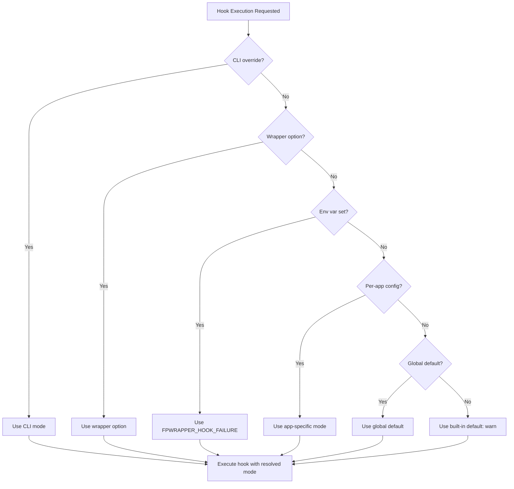

# Hook Failure Modes Design Specification

## Overview

This document specifies the design for configurable hook failure behavior in fplaunchwrapper. Currently, hooks always continue with a warning on failure. This feature will allow users to configure per-hook failure behavior with options to abort launches or ignore failures.

## Current State Analysis

### Python Launcher (`lib/launch.py`)

The [`_run_hook_scripts()`](lib/launch.py:133) method currently:
- Returns `True` if all scripts succeed, `False` if any fail
- Pre-launch hook failure aborts the launch (lines 471-476)
- Post-launch hook failure only prints a warning (lines 491-500)

### Wrapper Scripts (`templates/wrapper.template.sh`)

The wrapper template has two hook functions:

1. **[`run_pre_launch_script()`](templates/wrapper.template.sh:96)** - Executes pre-launch script with no error handling; continues regardless of exit code

2. **[`run_post_launch_script()`](templates/wrapper.template.sh:103)** - Executes post-launch script in subshell; prints warning on failure but continues

### Configuration Schema (`lib/config_manager.py`)

The [`AppPreferences`](lib/config_manager.py:80) dataclass currently stores:
- `pre_launch_script: str | None`
- `post_launch_script: str | None`

No failure behavior configuration exists.

---

## Design Specification

### Failure Mode Options

Three failure modes will be supported:

| Mode | Behavior |
|------|----------|
| `abort` | Abort the launch entirely if the hook fails (pre-launch only) |
| `warn` | Continue with a warning message (current default behavior) |
| `ignore` | Continue silently without warning |

### Configuration Hierarchy

Configuration will follow this precedence (highest to lowest):

1. **Runtime CLI override** (`--hook-failure`)
2. **Wrapper option override** (`--fpwrapper-hook-failure`)
3. **Per-app configuration** (`app_preferences.<app>.pre_launch_failure_mode`)
4. **Global configuration** (`global_preferences.hook_failure_mode_default`)
5. **Built-in default** (`warn`)

---

## TOML Schema Additions

### Global Configuration

```toml
# ~/.config/fplaunchwrapper/config.toml

[global_preferences]
# Default failure mode for all hooks (abort, warn, ignore)
hook_failure_mode_default = "warn"

# Default failure mode specifically for pre-launch hooks
# Overrides hook_failure_mode_default if set
pre_launch_failure_mode_default = "abort"

# Default failure mode specifically for post-launch hooks  
# Overrides hook_failure_mode_default if set
post_launch_failure_mode_default = "warn"
```

### Per-App Configuration

```toml
[app_preferences.firefox]
# Per-app hook failure modes
pre_launch_failure_mode = "abort"   # Abort if pre-launch fails
post_launch_failure_mode = "ignore" # Silently continue if post-launch fails

[app_preferences.code]
pre_launch_failure_mode = "warn"    # Warn but continue
post_launch_failure_mode = "warn"
```

### Configuration Schema Updates

Add to [`AppPreferences`](lib/config_manager.py:80) dataclass:

```python
@dataclass
class AppPreferences:
    launch_method: str = "auto"
    env_vars: dict[str, str] = field(default_factory=dict)
    pre_launch_script: str | None = None
    post_launch_script: str | None = None
    custom_args: list[str] = field(default_factory=list)
    # New fields
    pre_launch_failure_mode: str | None = None  # "abort", "warn", "ignore", or None for inherit
    post_launch_failure_mode: str | None = None
```

Add to [`WrapperConfig`](lib/config_manager.py:91) dataclass:

```python
@dataclass
class WrapperConfig:
    # ... existing fields ...
    # New global defaults
    hook_failure_mode_default: str = "warn"
    pre_launch_failure_mode_default: str | None = None
    post_launch_failure_mode_default: str | None = None
```

---

## CLI Options

### fplaunch-launch Command

Add new option to the launcher CLI:

```
fplaunch-launch [options] <app_name> [args...]

Options:
  --hook-failure MODE     Override failure mode for this launch
                          MODE: abort, warn, ignore
  --abort-on-hook-failure Shorthand for --hook-failure abort
  --ignore-hook-failure   Shorthand for --hook-failure ignore
```

### Implementation in [`main()`](lib/launch.py:514)

```python
parser.add_argument(
    "--hook-failure",
    choices=["abort", "warn", "ignore"],
    help="Override hook failure mode for this launch",
)

parser.add_argument(
    "--abort-on-hook-failure",
    action="store_const",
    dest="hook_failure",
    const="abort",
    help="Abort launch if any hook fails",
)

parser.add_argument(
    "--ignore-hook-failure",
    action="store_const",
    dest="hook_failure",
    const="ignore",
    help="Ignore hook failures silently",
)
```

---

## Wrapper Script Options

Add new `--fpwrapper-*` options to the wrapper template:

### New Options

```
--fpwrapper-hook-failure MODE     Set failure mode for this launch only
--fpwrapper-abort-on-hook-failure Shorthand for --fpwrapper-hook-failure abort
--fpwrapper-ignore-hook-failure   Shorthand for --fpwrapper-hook-failure ignore
```

### Wrapper Template Updates

Add to [`templates/wrapper.template.sh`](templates/wrapper.template.sh):

```bash
# Hook failure mode (can be overridden)
HOOK_FAILURE_MODE="{hook_failure_mode_default}"  # Populated from config
ONE_SHOT_HOOK_FAILURE=""

# Parse hook failure override
if [ "$1" = "--fpwrapper-hook-failure" ]; then
    if [ -z "$2" ]; then
        echo "Usage: $NAME --fpwrapper-hook-failure [abort|warn|ignore]" >&2
        exit 1
    fi
    case "$2" in
        abort|warn|ignore)
            ONE_SHOT_HOOK_FAILURE="$2"
            shift 2
            ;;
        *)
            echo "Invalid hook failure mode: $2 (use abort|warn|ignore)" >&2
            exit 1
            ;;
    esac
fi

if [ "$1" = "--fpwrapper-abort-on-hook-failure" ]; then
    ONE_SHOT_HOOK_FAILURE="abort"
    shift
fi

if [ "$1" = "--fpwrapper-ignore-hook-failure" ]; then
    ONE_SHOT_HOOK_FAILURE="ignore"
    shift
fi
```

### Updated Hook Functions

```bash
# Determine effective hook failure mode
get_hook_failure_mode() {
    if [ -n "$ONE_SHOT_HOOK_FAILURE" ]; then
        echo "$ONE_SHOT_HOOK_FAILURE"
    else
        echo "$HOOK_FAILURE_MODE"
    fi
}

# Pre-launch script execution with failure handling
run_pre_launch_script() {
    local failure_mode=$(get_hook_failure_mode)
    
    if [ -x "$PRE_SCRIPT" ]; then
        "$PRE_SCRIPT" "$NAME" "$ID" "$source" "$@"
        local hook_exit=$?
        
        if [ $hook_exit -ne 0 ]; then
            case "$failure_mode" in
                abort)
                    echo "[fplaunchwrapper] Pre-launch hook failed (exit $hook_exit), aborting launch" >&2
                    exit $hook_exit
                    ;;
                warn)
                    echo "[fplaunchwrapper] Warning: Pre-launch hook failed (exit $hook_exit)" >&2
                    ;;
                ignore)
                    # Silent continuation
                    ;;
            esac
        fi
    fi
}

# Post-launch script execution with failure handling
run_post_launch_script() {
    local exit_code="$1"
    local source="$2"
    local failure_mode=$(get_hook_failure_mode)
    
    if [ -x "$POST_SCRIPT" ]; then
        (
            export FPWRAPPER_EXIT_CODE="$exit_code"
            export FPWRAPPER_SOURCE="$source"
            export FPWRAPPER_WRAPPER_NAME="$NAME"
            export FPWRAPPER_APP_ID="$ID"
            "$POST_SCRIPT" "$NAME" "$ID" "$source" "$exit_code" "$@"
        )
        local hook_exit=$?
        
        if [ $hook_exit -ne 0 ]; then
            case "$failure_mode" in
                abort)
                    echo "[fplaunchwrapper] Post-launch hook failed (exit $hook_exit)" >&2
                    # Note: Cannot abort - app already ran. Return app's exit code.
                    ;;
                warn)
                    echo "[fplaunchwrapper] Warning: Post-launch hook failed (exit $hook_exit)" >&2
                    ;;
                ignore)
                    # Silent continuation
                    ;;
            esac
        fi
    fi
}
```

---

## Implementation Approach

### Phase 1: Configuration Schema

1. Update [`AppPreferences`](lib/config_manager.py:80) dataclass with new fields
2. Update [`WrapperConfig`](lib/config_manager.py:91) dataclass with global defaults
3. Update Pydantic models ([`PydanticAppPreferences`](lib/config_manager.py:774), [`PydanticWrapperConfig`](lib/config_manager.py:853))
4. Add validation for failure mode values (`abort`, `warn`, `ignore`)
5. Update [`_serialize_config()`](lib/config_manager.py:405) and [`_apply_unvalidated_config()`](lib/config_manager.py:355)

### Phase 2: Python Launcher

1. Add CLI arguments to [`main()`](lib/launch.py:514)
2. Pass failure mode to [`AppLauncher`](lib/launch.py:44) constructor
3. Update [`_run_hook_scripts()`](lib/launch.py:133) to accept and use failure mode
4. Implement failure mode resolution logic (config hierarchy)

### Phase 3: Wrapper Template

1. Add placeholder for default failure mode in template
2. Add new `--fpwrapper-*` options parsing
3. Update [`run_pre_launch_script()`](templates/wrapper.template.sh:96) with failure handling
4. Update [`run_post_launch_script()`](templates/wrapper.template.sh:103) with failure handling
5. Update [`--fpwrapper-help`](templates/wrapper.template.sh:181) output

### Phase 4: Wrapper Generation

1. Update [`WrapperGenerator`](lib/generate.py) to read failure mode config
2. Populate `{hook_failure_mode_default}` placeholder from config
3. Ensure per-app settings are embedded in generated wrappers

---

## Edge Cases

### 1. Post-Launch Abort Semantics

**Issue**: Post-launch hooks run after the application exits. "Abort" doesn't make sense since the app already ran.

**Resolution**: 
- For post-launch hooks, `abort` mode behaves like `warn` but returns the hook's exit code instead of the app's exit code
- Document this behavioral difference clearly

### 2. Timeout Handling

**Issue**: Hooks can timeout (30-second limit in Python launcher).

**Resolution**:
- Timeouts are treated as failures
- Apply the configured failure mode to timeout scenarios
- Distinguish timeout from regular failure in warning messages

### 3. Non-Interactive Mode

**Issue**: Wrapper bypasses prompts in non-interactive mode.

**Resolution**:
- Hook failure modes apply equally in non-interactive mode
- `abort` mode should exit non-interactively without prompts

### 4. Multiple Hook Scripts

**Issue**: Currently only one pre/post script per app, but design allows for multiple.

**Resolution**:
- Apply failure mode to each script independently
- On `abort`, stop processing remaining scripts immediately
- Document that scripts run in an undefined order

### 5. Environment Variable Override

**Issue**: Should `FPWRAPPER_HOOK_FAILURE` env var be supported?

**Resolution**:
- Yes, add `FPWRAPPER_HOOK_FAILURE` environment variable support
- Precedence: CLI > env var > config
- This allows external tools/scripts to control behavior

### 6. Missing Script Handling

**Issue**: Configured script path doesn't exist or isn't executable.

**Resolution**:
- Missing/non-executable scripts are logged as warnings in verbose mode
- Not treated as "failures" - the hook simply doesn't run
- Only actual execution failures trigger failure mode behavior

### 7. Invalid Failure Mode Value

**Issue**: Config contains invalid failure mode value.

**Resolution**:
- Pydantic validation rejects invalid values at config load
- Fallback to `warn` with a warning message
- Log the validation error clearly

### 8. Wrapper Regeneration

**Issue**: Changing config doesn't update existing wrappers.

**Resolution**:
- Wrappers embed the default failure mode at generation time
- Runtime overrides (`--fpwrapper-hook-failure`) always available
- Document that regenerating wrappers picks up new defaults

---

## Configuration Resolution Flow



---

## Testing Considerations

### Unit Tests

1. Configuration parsing with valid/invalid failure modes
2. Failure mode resolution hierarchy
3. Hook execution with each failure mode
4. Timeout handling with each failure mode

### Integration Tests

1. End-to-end launch with `--hook-failure` CLI option
2. Wrapper script `--fpwrapper-hook-failure` option
3. Config file per-app failure mode
4. Environment variable override

### Edge Case Tests

1. Post-launch abort mode behavior
2. Missing script handling
3. Invalid configuration values
4. Non-interactive mode with abort

---

## Documentation Updates

### Files to Update

1. **DESIGN.md** - Update Hook System section with failure mode documentation
2. **COMMAND_REFERENCE.md** - Add new CLI and wrapper options
3. **templates/wrapper.template.sh** - Update help output
4. **README.md** - Add example usage

### Example Documentation

```markdown
## Hook Failure Modes

Hooks can be configured with three failure behaviors:

- **abort**: Stop the launch entirely if the hook fails (pre-launch only)
- **warn**: Continue with a warning message (default)
- **ignore**: Continue silently

### Configuration

```toml
# Global default
[global_preferences]
hook_failure_mode_default = "warn"

# Per-app override
[app_preferences.myapp]
pre_launch_failure_mode = "abort"
```

### Runtime Override

```bash
# Abort launch if pre-launch hook fails
myapp --fpwrapper-abort-on-hook-failure

# Ignore hook failures silently
myapp --fpwrapper-ignore-hook-failure
```
```

---

## Summary

This design provides a comprehensive solution for configurable hook failure modes:

1. **Three failure modes**: `abort`, `warn`, `ignore`
2. **Flexible configuration**: Global defaults, per-app overrides, runtime options
3. **Multiple control points**: Config file, CLI options, wrapper options, environment variables
4. **Clear semantics**: Well-defined behavior for edge cases like post-launch aborts
5. **Backward compatible**: Default behavior (`warn`) matches current implementation
