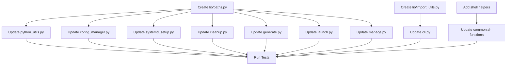

# Refactoring Plan: Code Duplication Cleanup

**Author:** Architecture Analysis  
**Date:** 2026-02-15  
**Status:** Draft  
**Target Version:** Next Minor Release

---

## Executive Summary

This document outlines a comprehensive refactoring plan to address code duplication issues identified in the fplaunchwrapper codebase. The refactoring targets four primary areas:

| Issue | Priority | Impact | Risk Level |
|-------|----------|--------|------------|
| Python Path Resolution Duplication | HIGH | 6 files affected | Low |
| mkdir Pattern Duplication | MEDIUM | 14 occurrences | Low |
| ImportError Handling Pattern | HIGH | ~25 occurrences in cli.py | Medium |
| Shell Script Python Fallback Pattern | MEDIUM | 7 occurrences in common.sh | Low |

**Estimated Total Impact:** Reduced code duplication by approximately 200+ lines, improved maintainability, and centralized path management.

---

## Issue 1: Python Path Resolution Duplication (HIGH PRIORITY)

### Current State

The config directory resolution `Path.home() / ".config" / "fplaunchwrapper"` appears in 6 files:

| File | Line(s) | Context |
|------|---------|---------|
| [`lib/manage.py`](lib/manage.py:51) | 51-53 | `WrapperManager.__init__` |
| [`lib/launch.py`](lib/launch.py:103) | 103-105 | `AppLauncher.__init__` |
| [`lib/cleanup.py`](lib/cleanup.py:53) | 53-55 | `CleanupConfig.__post_init__` |
| [`lib/generate.py`](lib/generate.py:141) | 141-143 | `WrapperGenerator.__init__` |
| [`lib/python_utils.py`](lib/python_utils.py:260) | 260, 294 | `acquire_lock`, `release_lock` |
| [`lib/config_manager.py`](lib/config_manager.py:167) | 167-174 | `EnhancedConfigManager.__init__` |

The bin directory resolution `Path.home() / "bin"` appears in 4+ files:

| File | Line(s) | Context |
|------|---------|---------|
| [`lib/manage.py`](lib/manage.py:64) | 64-69 | Default bin_dir fallback (3 times) |
| [`lib/launch.py`](lib/launch.py:114) | 114-115 | Default bin_dir fallback |
| [`lib/cleanup.py`](lib/cleanup.py:52) | 52 | `CleanupConfig.__post_init__` |
| [`lib/systemd_setup.py`](lib/systemd_setup.py:30) | 30 | `SystemdSetup.__init__` |

### Proposed Solution

Create a new centralized module `lib/paths.py` that provides:

1. **Path resolution functions** with XDG Base Directory specification support
2. **Cached path values** for performance
3. **Environment variable override support**

### Implementation Details

#### Step 1: Create `lib/paths.py`

```python
#!/usr/bin/env python3
"""Centralized path resolution for fplaunchwrapper.

Provides consistent path resolution following XDG Base Directory specification.
All path values are cached after first access for performance.
"""

from __future__ import annotations

import os
from functools import lru_cache
from pathlib import Path
from typing import Union


@lru_cache(maxsize=1)
def get_config_dir() -> Path:
    """Get the configuration directory path.
    
    Resolves in order:
    1. FPWRAPPER_CONFIG_DIR environment variable
    2. XDG_CONFIG_HOME/fplaunchwrapper
    3. ~/.config/fplaunchwrapper
    
    Returns:
        Path to the configuration directory
    """
    # Check for explicit override
    env_override = os.environ.get("FPWRAPPER_CONFIG_DIR")
    if env_override:
        return Path(env_override).expanduser().resolve()
    
    # Use XDG specification
    xdg_config_home = os.environ.get(
        "XDG_CONFIG_HOME",
        str(Path.home() / ".config")
    )
    return Path(xdg_config_home) / "fplaunchwrapper"


@lru_cache(maxsize=1)
def get_data_dir() -> Path:
    """Get the data directory path.
    
    Resolves in order:
    1. FPWRAPPER_DATA_DIR environment variable
    2. XDG_DATA_HOME/fplaunchwrapper
    3. ~/.local/share/fplaunchwrapper
    
    Returns:
        Path to the data directory
    """
    env_override = os.environ.get("FPWRAPPER_DATA_DIR")
    if env_override:
        return Path(env_override).expanduser().resolve()
    
    xdg_data_home = os.environ.get(
        "XDG_DATA_HOME",
        str(Path.home() / ".local" / "share")
    )
    return Path(xdg_data_home) / "fplaunchwrapper"


@lru_cache(maxsize=1)
def get_default_bin_dir() -> Path:
    """Get the default bin directory path.
    
    Resolves in order:
    1. FPWRAPPER_BIN_DIR environment variable
    2. ~/bin (user's local bin directory)
    
    Returns:
        Path to the default bin directory
    """
    env_override = os.environ.get("FPWRAPPER_BIN_DIR")
    if env_override:
        return Path(env_override).expanduser().resolve()
    
    return Path.home() / "bin"


def get_bin_dir_from_config() -> Path | None:
    """Read the configured bin directory from the config file.
    
    Returns:
        Path to the configured bin directory, or None if not configured
    """
    bin_dir_file = get_config_dir() / "bin_dir"
    if bin_dir_file.exists():
        try:
            bin_dir_path = bin_dir_file.read_text().strip()
            if bin_dir_path:
                return Path(bin_dir_path)
        except (OSError, UnicodeDecodeError):
            pass
    return None


def resolve_bin_dir(explicit_dir: Union[str, Path, None] = None) -> Path:
    """Resolve the bin directory with full fallback chain.
    
    Priority order:
    1. Explicitly provided directory
    2. Configured bin_dir from config file
    3. Default bin directory (~/bin)
    
    Args:
        explicit_dir: Optional explicit bin directory path
        
    Returns:
        Resolved Path to the bin directory
    """
    if explicit_dir:
        return Path(explicit_dir).expanduser().resolve()
    
    configured = get_bin_dir_from_config()
    if configured:
        return configured
    
    return get_default_bin_dir()


def ensure_dir(path: Path, *, create: bool = True) -> Path:
    """Ensure a directory exists, creating it if necessary.
    
    Args:
        path: Directory path to ensure
        create: If True, create the directory if it doesn't exist
        
    Returns:
        The path (for chaining)
        
    Raises:
        OSError: If directory creation fails
    """
    if create and not path.exists():
        path.mkdir(parents=True, exist_ok=True)
    return path


def get_lock_dir() -> Path:
    """Get the lock directory path.
    
    Returns:
        Path to the locks directory within config dir
    """
    return get_config_dir() / "locks"


def get_scripts_dir() -> Path:
    """Get the scripts directory path.
    
    Returns:
        Path to the scripts directory within config dir
    """
    return get_config_dir() / "scripts"


def get_systemd_unit_dir() -> Path:
    """Get the systemd user unit directory path.
    
    Returns:
        Path to the systemd user unit directory
    """
    xdg_config_home = os.environ.get(
        "XDG_CONFIG_HOME",
        str(Path.home() / ".config")
    )
    return Path(xdg_config_home) / "systemd" / "user"


# Clear all caches (useful for testing)
def clear_path_caches() -> None:
    """Clear all cached path values."""
    get_config_dir.cache_clear()
    get_data_dir.cache_clear()
    get_default_bin_dir.cache_clear()
```

#### Step 2: Update `lib/manage.py`

**Before (lines 51-69):**
```python
self.config_dir = Path(
    config_dir or (Path.home() / ".config" / "fplaunchwrapper"),
)

if bin_dir:
    self.bin_dir = Path(bin_dir)
else:
    bin_dir_file = self.config_dir / "bin_dir"
    try:
        if bin_dir_file.exists():
            bin_dir_path = bin_dir_file.read_text().strip()
            if bin_dir_path:
                self.bin_dir = Path(bin_dir_path)
            else:
                self.bin_dir = Path.home() / "bin"
        else:
            self.bin_dir = Path.home() / "bin"
    except (OSError, UnicodeDecodeError):
        self.bin_dir = Path.home() / "bin"
```

**After:**
```python
from lib.paths import get_config_dir, resolve_bin_dir, ensure_dir

self.config_dir = Path(config_dir) if config_dir else get_config_dir()
self.bin_dir = resolve_bin_dir(bin_dir)
```

#### Step 3: Update `lib/launch.py`

**Before (lines 103-115):**
```python
self.config_dir = Path(
    config_dir or (Path.home() / ".config" / "fplaunchwrapper"),
)
self.config_dir.mkdir(parents=True, exist_ok=True)

if bin_dir:
    self.bin_dir = Path(bin_dir)
else:
    bin_dir_file = self.config_dir / "bin_dir"
    if bin_dir_file.exists():
        self.bin_dir = Path(bin_dir_file.read_text().strip())
    else:
        self.bin_dir = Path.home() / "bin"
```

**After:**
```python
from lib.paths import get_config_dir, resolve_bin_dir, ensure_dir

self.config_dir = Path(config_dir) if config_dir else get_config_dir()
ensure_dir(self.config_dir)
self.bin_dir = resolve_bin_dir(bin_dir)
```

#### Step 4: Update `lib/cleanup.py`

**Before (lines 52-58):**
```python
self.bin_dir_path = Path(self.bin_dir or (Path.home() / "bin"))
self.config_dir_path = Path(
    self.config_dir or (Path.home() / ".config" / "fplaunchwrapper"),
)
self.data_dir_path = Path(
    self.data_dir or (Path.home() / ".local" / "share" / "fplaunchwrapper")
)
```

**After:**
```python
from lib.paths import get_config_dir, get_data_dir, get_default_bin_dir

self.bin_dir_path = Path(self.bin_dir) if self.bin_dir else get_default_bin_dir()
self.config_dir_path = Path(self.config_dir) if self.config_dir else get_config_dir()
self.data_dir_path = Path(self.data_dir) if self.data_dir else get_data_dir()
```

#### Step 5: Update `lib/generate.py`

**Before (lines 139-148):**
```python
self.config_dir = (
    Path(config_dir)
    if config_dir
    else (Path.home() / ".config" / "fplaunchwrapper")
)

# Ensure directories exist (unless in emit mode)
if not emit_mode:
    self.bin_dir.mkdir(parents=True, exist_ok=True)
    self.config_dir.mkdir(parents=True, exist_ok=True)
```

**After:**
```python
from lib.paths import get_config_dir, ensure_dir

self.config_dir = Path(config_dir) if config_dir else get_config_dir()

# Ensure directories exist (unless in emit mode)
if not emit_mode:
    ensure_dir(self.bin_dir)
    ensure_dir(self.config_dir)
```

#### Step 6: Update `lib/python_utils.py`

**Before (lines 260-264):**
```python
config_dir = Path.home() / ".config" / "fplaunchwrapper"
config_dir.mkdir(parents=True, exist_ok=True)

lock_dir = config_dir / "locks"
lock_dir.mkdir(parents=True, exist_ok=True)
```

**After:**
```python
from lib.paths import get_config_dir, get_lock_dir, ensure_dir

config_dir = get_config_dir()
ensure_dir(config_dir)

lock_dir = get_lock_dir()
ensure_dir(lock_dir)
```

#### Step 7: Update `lib/config_manager.py`

**Before (lines 167-174):**
```python
xdg_config_home = os.environ.get(
    "XDG_CONFIG_HOME", str(Path.home() / ".config")
)
xdg_data_home = os.environ.get(
    "XDG_DATA_HOME", str(Path.home() / ".local" / "share")
)
self.config_dir = Path(xdg_config_home) / app_name
self.data_dir = Path(xdg_data_home) / app_name
```

**After:**
```python
from lib.paths import get_config_dir, get_data_dir, ensure_dir

self.config_dir = get_config_dir()
self.data_dir = get_data_dir()
```

#### Step 8: Update `lib/systemd_setup.py`

**Before (line 30):**
```python
self.bin_dir = Path(bin_dir or (Path.home() / "bin"))
```

**After:**
```python
from lib.paths import get_default_bin_dir

self.bin_dir = Path(bin_dir) if bin_dir else get_default_bin_dir()
```

### Test Impact Analysis

| Test File | Changes Required |
|-----------|------------------|
| `tests/python/test_manage.py` | Mock `lib.paths` functions |
| `tests/python/test_launch.py` | Mock `lib.paths` functions |
| `tests/python/test_cleanup_*.py` | Mock `lib.paths` functions |
| `tests/python/test_generate_*.py` | Mock `lib.paths` functions |
| `tests/python/test_python_utils.py` | Mock `lib.paths` functions |
| `tests/python/test_config_manager.py` | Mock `lib.paths` functions |
| `tests/python/test_systemd_*.py` | Mock `lib.paths` functions |

**New Test File Required:** `tests/python/test_paths.py`

```python
"""Tests for lib/paths.py module."""

import os
import pytest
from pathlib import Path
from unittest.mock import patch

from lib.paths import (
    get_config_dir,
    get_data_dir,
    get_default_bin_dir,
    resolve_bin_dir,
    clear_path_caches,
)


class TestPathResolution:
    """Test path resolution functions."""
    
    def setup_method(self):
        """Clear caches before each test."""
        clear_path_caches()
    
    def test_get_config_dir_default(self, tmp_path, monkeypatch):
        """Test default config directory resolution."""
        monkeypatch.delenv("FPWRAPPER_CONFIG_DIR", raising=False)
        monkeypatch.delenv("XDG_CONFIG_HOME", raising=False)
        
        result = get_config_dir()
        expected = Path.home() / ".config" / "fplaunchwrapper"
        assert result == expected
    
    def test_get_config_dir_xdg_override(self, monkeypatch):
        """Test XDG_CONFIG_HOME override."""
        monkeypatch.delenv("FPWRAPPER_CONFIG_DIR", raising=False)
        monkeypatch.setenv("XDG_CONFIG_HOME", "/custom/config")
        
        result = get_config_dir()
        assert result == Path("/custom/config/fplaunchwrapper")
    
    def test_get_config_dir_env_override(self, monkeypatch):
        """Test FPWRAPPER_CONFIG_DIR environment override."""
        monkeypatch.setenv("FPWRAPPER_CONFIG_DIR", "/custom/path")
        
        result = get_config_dir()
        assert result == Path("/custom/path")
    
    def test_resolve_bin_dir_explicit(self):
        """Test explicit bin directory takes priority."""
        result = resolve_bin_dir("/explicit/bin")
        assert result == Path("/explicit/bin")
    
    def test_resolve_bin_dir_from_config(self, tmp_path, monkeypatch):
        """Test reading bin_dir from config file."""
        clear_path_caches()
        config_dir = tmp_path / "config"
        config_dir.mkdir(parents=True)
        (config_dir / "bin_dir").write_text("/configured/bin")
        
        monkeypatch.setenv("FPWRAPPER_CONFIG_DIR", str(config_dir))
        
        result = resolve_bin_dir()
        assert result == Path("/configured/bin")
```

---

## Issue 2: mkdir Pattern Duplication (MEDIUM PRIORITY)

### Current State

The pattern `mkdir(parents=True, exist_ok=True)` appears 14+ times across files:

| File | Occurrences |
|------|-------------|
| `lib/manage.py` | 2 (lines 72-73, 1059) |
| `lib/launch.py` | 1 (line 106) |
| `lib/generate.py` | 2 (lines 147-148) |
| `lib/python_utils.py` | 2 (lines 261, 264) |
| `lib/config_manager.py` | 2 (lines 195, 199) |
| `lib/systemd_setup.py` | 1 (line 287) |
| `lib/cleanup.py` | 4 (lines 389, 394, 399, 400) |

### Proposed Solution

The `ensure_dir()` function in the new `lib/paths.py` module (from Issue 1) addresses this duplication. All `mkdir(parents=True, exist_ok=True)` calls should be replaced with `ensure_dir(path)`.

### Implementation Details

**Before:**
```python
self.bin_dir.mkdir(parents=True, exist_ok=True)
self.config_dir.mkdir(parents=True, exist_ok=True)
```

**After:**
```python
from lib.paths import ensure_dir

ensure_dir(self.bin_dir)
ensure_dir(self.config_dir)
```

### Test Impact Analysis

No additional tests required beyond those for Issue 1.

---

## Issue 3: ImportError Handling Pattern (HIGH PRIORITY)

### Current State

In [`lib/cli.py`](lib/cli.py), there are approximately 25 occurrences of:

```python
except ImportError as e:
    console_err.print(f"[red]Error:[/red] Failed to import ...: {e}")
    raise SystemExit(1)
```

Locations include:
- Lines 174-176 (generate command)
- Lines 209-211 (list_wrappers command)
- Lines 244-246 (install command)
- Lines 291-293 (uninstall command)
- Lines 338-340 (launch command)
- Lines 364-366 (remove command)
- Lines 389-391 (cleanup command)
- Lines 405-407 (clean command)
- Lines 435-437 (monitor command)
- Lines 461-463 (set_pref command)
- Lines 498-500 (rm command)
- Lines 538-540 (_run_systemd_setup)
- Lines 672-674 (info command)
- Lines 696-698 (search command)
- Lines 734-736 (profiles_list)
- Lines 758-760 (profiles_create)
- Lines 781-783 (profiles_switch)
- Lines 797-799 (profiles_current)
- Lines 823-825 (profiles_export)
- Lines 850-852 (profiles_import)
- Lines 879-881 (presets_list)
- Lines 905-907 (presets_get)
- Lines 927-929 (presets_add)
- Lines 947-949 (presets_remove)
- Lines 1030-1032 (files command)
- Lines 1118-1120 (config command)

### Proposed Solution

Create a **decorator** and/or **context manager** for standardized ImportError handling.

### Implementation Details

#### Step 1: Create `lib/import_utils.py`

```python
#!/usr/bin/env python3
"""Import utilities for fplaunchwrapper.

Provides standardized error handling for import failures.
"""

from __future__ import annotations

import functools
import sys
from typing import Callable, TypeVar, Any

from rich.console import Console

console_err = Console(stderr=True)

F = TypeVar('F', bound=Callable[..., Any])


def handle_import_error(
    module_name: str | None = None,
    message: str | None = None,
    exit_code: int = 1,
) -> Callable[[F], F]:
    """Decorator to handle ImportError with standardized error message.
    
    Args:
        module_name: Name of the module being imported (for error message)
        message: Custom error message (overrides default)
        exit_code: Exit code to use on failure (default: 1)
        
    Returns:
        Decorated function that handles ImportError
        
    Example:
        @handle_import_error("wrapper generator")
        def generate():
            from lib.generate import WrapperGenerator
            ...
    """
    def decorator(func: F) -> F:
        @functools.wraps(func)
        def wrapper(*args, **kwargs) -> Any:
            try:
                return func(*args, **kwargs)
            except ImportError as e:
                if message:
                    error_msg = message
                elif module_name:
                    error_msg = f"Failed to import {module_name}: {e}"
                else:
                    error_msg = f"Failed to import required module: {e}"
                
                console_err.print(f"[red]Error:[/red] {error_msg}")
                raise SystemExit(exit_code)
        
        return wrapper  # type: ignore[return-value]
    
    return decorator


class import_or_exit:
    """Context manager for import-or-exit pattern.
    
    Use when you need to import a module and exit if it fails,
    but don't want to wrap an entire function.
    
    Example:
        with import_or_exit("lib.generate", "wrapper generator"):
            from lib.generate import WrapperGenerator
            generator = WrapperGenerator(...)
    """
    
    def __init__(
        self,
        module_name: str = "required module",
        custom_message: str | None = None,
        exit_code: int = 1,
    ) -> None:
        self.module_name = module_name
        self.custom_message = custom_message
        self.exit_code = exit_code
    
    def __enter__(self) -> "import_or_exit":
        return self
    
    def __exit__(self, exc_type, exc_val, exc_tb) -> None:
        if exc_type is ImportError:
            if self.custom_message:
                error_msg = self.custom_message
            else:
                error_msg = f"Failed to import {self.module_name}: {exc_val}"
            
            console_err.print(f"[red]Error:[/red] {error_msg}")
            raise SystemExit(self.exit_code)
        return None  # Don't suppress other exceptions


def safe_import(
    module: str,
    *,
    error_message: str | None = None,
    exit_on_failure: bool = True,
) -> Any:
    """Safely import a module with optional exit on failure.
    
    Args:
        module: Module name to import
        error_message: Custom error message
        exit_on_failure: If True, exit on ImportError; if False, return None
        
    Returns:
        The imported module, or None if exit_on_failure is False and import fails
        
    Example:
        WrapperGenerator = safe_import("lib.generate", error_message="wrapper generator not available")
    """
    try:
        # Use importlib for dynamic import
        import importlib
        return importlib.import_module(module)
    except ImportError as e:
        if not exit_on_failure:
            return None
        
        if error_message:
            msg = error_message
        else:
            msg = f"Failed to import {module}: {e}"
        
        console_err.print(f"[red]Error:[/red] {msg}")
        raise SystemExit(1)
```

#### Step 2: Update `lib/cli.py` - Decorator Approach

**Before (lines 160-177):**
```python
def generate(ctx, bin_dir) -> int:
    """Generate Flatpak application wrappers..."""
    if not bin_dir:
        bin_dir = os.path.expanduser("~/bin")

    try:
        from lib.generate import WrapperGenerator

        generator = _instantiate_compat(
            WrapperGenerator,
            bin_dir=bin_dir,
            config_dir=ctx.obj.get("config_dir"),
            verbose=ctx.obj.get("verbose", False),
            emit_mode=ctx.obj.get("emit", False),
            emit_verbose=ctx.obj.get("emit_verbose", False),
        )
        result: int = generator.run()
        return result
    except ImportError as e:
        console_err.print(f"[red]Error:[/red] Failed to import wrapper generator: {e}")
        raise SystemExit(1)
```

**After:**
```python
from lib.import_utils import handle_import_error

@cli.command()
@click.argument("bin_dir", required=False)
@click.pass_context
@handle_import_error("wrapper generator")
def generate(ctx, bin_dir) -> int:
    """Generate Flatpak application wrappers..."""
    if not bin_dir:
        bin_dir = os.path.expanduser("~/bin")

    from lib.generate import WrapperGenerator

    generator = _instantiate_compat(
        WrapperGenerator,
        bin_dir=bin_dir,
        config_dir=ctx.obj.get("config_dir"),
        verbose=ctx.obj.get("verbose", False),
        emit_mode=ctx.obj.get("emit", False),
        emit_verbose=ctx.obj.get("emit_verbose", False),
    )
    result: int = generator.run()
    return result
```

#### Step 3: Alternative - Context Manager Approach

For cases where the decorator approach doesn't fit well:

```python
from lib.import_utils import import_or_exit

@cli.command()
@click.argument("bin_dir", required=False)
@click.pass_context
def generate(ctx, bin_dir) -> int:
    """Generate Flatpak application wrappers..."""
    if not bin_dir:
        bin_dir = os.path.expanduser("~/bin")

    with import_or_exit("wrapper generator"):
        from lib.generate import WrapperGenerator

    generator = _instantiate_compat(
        WrapperGenerator,
        bin_dir=bin_dir,
        config_dir=ctx.obj.get("config_dir"),
        verbose=ctx.obj.get("verbose", False),
        emit_mode=ctx.obj.get("emit", False),
        emit_verbose=ctx.obj.get("emit_verbose", False),
    )
    return generator.run()
```

### Test Impact Analysis

| Test File | Changes Required |
|-----------|------------------|
| `tests/python/test_cli_flags.py` | Verify error messages still work |
| `tests/python/test_missing_cli_coverage.py` | Update import error tests |

**New Test File Required:** `tests/python/test_import_utils.py`

```python
"""Tests for lib/import_utils.py module."""

import pytest
from unittest.mock import patch
from click.testing import CliRunner

from lib.import_utils import handle_import_error, import_or_exit, safe_import


class TestHandleImportError:
    """Test the handle_import_error decorator."""
    
    def test_successful_import(self):
        """Test that successful imports pass through."""
        @handle_import_error("test module")
        def successful_func():
            import os
            return "success"
        
        assert successful_func() == "success"
    
    def test_import_error_exits(self):
        """Test that ImportError causes SystemExit."""
        @handle_import_error("test module")
        def failing_func():
            import nonexistent_module_xyz  # noqa: F401
        
        with pytest.raises(SystemExit) as exc_info:
            failing_func()
        
        assert exc_info.value.code == 1
    
    def test_custom_exit_code(self):
        """Test custom exit code."""
        @handle_import_error("test module", exit_code=42)
        def failing_func():
            import nonexistent_module_xyz  # noqa: F401
        
        with pytest.raises(SystemExit) as exc_info:
            failing_func()
        
        assert exc_info.value.code == 42


class TestImportOrExit:
    """Test the import_or_exit context manager."""
    
    def test_successful_import(self):
        """Test successful import in context."""
        with import_or_exit("os module"):
            import os
        
        # Should not raise
    
    def test_import_error_exits(self):
        """Test that ImportError causes SystemExit."""
        with pytest.raises(SystemExit):
            with import_or_exit("nonexistent module"):
                import nonexistent_module_xyz  # noqa: F401


class TestSafeImport:
    """Test the safe_import function."""
    
    def test_successful_import(self):
        """Test successful module import."""
        result = safe_import("os")
        import os
        assert result is os
    
    def test_import_error_returns_none(self):
        """Test that ImportError returns None when exit_on_failure=False."""
        result = safe_import("nonexistent_module_xyz", exit_on_failure=False)
        assert result is None
    
    def test_import_error_exits(self):
        """Test that ImportError exits when exit_on_failure=True."""
        with pytest.raises(SystemExit):
            safe_import("nonexistent_module_xyz")
```

---

## Issue 4: Shell Script Python Fallback Pattern (MEDIUM PRIORITY)

### Current State

In [`lib/common.sh`](lib/common.sh), this pattern repeats 7 times:

```bash
if _check_python3 && [ -f "$(dirname "${BASH_SOURCE[0]}")/python_utils.py" ]; then
    python3 "$(dirname "${BASH_SOURCE[0]}")/python_utils.py" <function_name> ...
fi
```

Locations:
- Lines 213-219 (`canonicalize_path_no_resolve`)
- Lines 255-261 (`validate_home_dir`)
- Lines 307-309 (`is_wrapper_file`)
- Lines 350-352 (`get_wrapper_id`)
- Lines 462-464 (`find_executable`)
- Lines 494-496 (`safe_mktemp`)
- Lines 530-532 (`sanitize_id_to_name`)

### Proposed Solution

Create a shell function helper that encapsulates the Python fallback pattern.

### Implementation Details

#### Step 1: Add Helper Function to `lib/common.sh`

Add this function near the top of `lib/common.sh`, after the `_check_python3` function:

```bash
# Get the directory containing this script
_get_script_dir() {
    dirname "${BASH_SOURCE[0]}"
}

# Check if Python utils are available
_has_python_utils() {
    _check_python3 && [ -f "$(_get_script_dir)/python_utils.py" ]
}

# Call Python utility function with fallback support
# Usage: _call_python_utils <function_name> [args...]
# Returns: 0 on success, 1 on failure
# Output: Function result on stdout
_call_python_utils() {
    local func_name="$1"
    shift
    
    if _has_python_utils; then
        python3 "$(_get_script_dir)/python_utils.py" "$func_name" "$@" 2>/dev/null
        return $?
    fi
    return 1
}

# Call Python utility function with fallback
# Usage: _call_python_utils_or_fallback <function_name> <fallback_command...>
# Executes fallback_command if Python utils not available
_call_python_utils_or_fallback() {
    local func_name="$1"
    shift
    
    if _has_python_utils; then
        python3 "$(_get_script_dir)/python_utils.py" "$func_name" "$@" 2>/dev/null
        return $?
    fi
    
    # Execute fallback
    "$@"
    return $?
}
```

#### Step 2: Update `canonicalize_path_no_resolve`

**Before (lines 208-246):**
```bash
canonicalize_path_no_resolve() {
    local path="$1"
    [ -n "$path" ] || return 1
    
    # Use Python utility for robust path normalization if available
    if _check_python3 && [ -f "$(dirname "${BASH_SOURCE[0]}")/python_utils.py" ]; then
        local result
        result=$(python3 "$(dirname "${BASH_SOURCE[0]}")/python_utils.py" canonicalize_path "$path" 2>/dev/null)
        if [ -n "$result" ]; then
            printf '%s' "$result"
            return 0
        fi
    fi
    
    # Fallback to original implementation
    # ... (rest of function)
}
```

**After:**
```bash
canonicalize_path_no_resolve() {
    local path="$1"
    [ -n "$path" ] || return 1
    
    # Use Python utility for robust path normalization if available
    local result
    result=$(_call_python_utils canonicalize_path "$path")
    if [ -n "$result" ]; then
        printf '%s' "$result"
        return 0
    fi
    
    # Fallback to original implementation
    # ... (rest of function)
}
```

#### Step 3: Update `validate_home_dir`

**Before (lines 248-296):**
```bash
validate_home_dir() {
    local dir="$1"
    if [ -z "$dir" ]; then
        return 1
    fi
    
    # Use Python utility for robust path validation if available
    if _check_python3 && [ -f "$(dirname "${BASH_SOURCE[0]}")/python_utils.py" ]; then
        local result
        result=$(python3 "$(dirname "${BASH_SOURCE[0]}")/python_utils.py" validate_home "$dir" 2>/dev/null)
        if [ -n "$result" ]; then
            printf '%s' "$result"
            return 0
        fi
    fi
    
    # Fallback to original implementation
    # ... (rest of function)
}
```

**After:**
```bash
validate_home_dir() {
    local dir="$1"
    if [ -z "$dir" ]; then
        return 1
    fi
    
    # Use Python utility for robust path validation if available
    local result
    result=$(_call_python_utils validate_home "$dir")
    if [ -n "$result" ]; then
        printf '%s' "$result"
        return 0
    fi
    
    # Fallback to original implementation
    # ... (rest of function)
}
```

#### Step 4: Update `is_wrapper_file`

**Before (lines 298-344):**
```bash
is_wrapper_file() {
    local file="$1"
    
    # Basic validation first
    [ -f "$file" ] || return 1
    [ -r "$file" ] || return 1
    [ ! -L "$file" ] || return 1  # Reject symlinks
    
    # Use Python utility for robust content validation if available
    if _check_python3 && [ -f "$(dirname "${BASH_SOURCE[0]}")/python_utils.py" ]; then
        python3 "$(dirname "${BASH_SOURCE[0]}")/python_utils.py" is_wrapper_file "$file" >/dev/null 2>&1 && return 0
    fi
    
    # Fallback to original implementation
    # ... (rest of function)
}
```

**After:**
```bash
is_wrapper_file() {
    local file="$1"
    
    # Basic validation first
    [ -f "$file" ] || return 1
    [ -r "$file" ] || return 1
    [ ! -L "$file" ] || return 1  # Reject symlinks
    
    # Use Python utility for robust content validation if available
    if _has_python_utils; then
        _call_python_utils is_wrapper_file "$file" >/dev/null 2>&1 && return 0
    fi
    
    # Fallback to original implementation
    # ... (rest of function)
}
```

#### Step 5: Update `get_wrapper_id`

**Before (lines 346-369):**
```bash
get_wrapper_id() {
    local file="$1"
    
    # Use Python utility for robust ID extraction if available
    if _check_python3 && [ -f "$(dirname "${BASH_SOURCE[0]}")/python_utils.py" ]; then
        python3 "$(dirname "${BASH_SOURCE[0]}")/python_utils.py" get_wrapper_id "$file" 2>/dev/null && return 0
    fi
    
    # Fallback to original implementation
    # ... (rest of function)
}
```

**After:**
```bash
get_wrapper_id() {
    local file="$1"
    
    # Use Python utility for robust ID extraction if available
    if _has_python_utils; then
        _call_python_utils get_wrapper_id "$file" && return 0
    fi
    
    # Fallback to original implementation
    # ... (rest of function)
}
```

#### Step 6: Update `find_executable`

**Before (lines 456-487):**
```bash
find_executable() {
    local cmd="$1"
    
    [ -n "$cmd" ] || return 1
    
    # Use Python utility for robust path resolution if available
    if _check_python3 && [ -f "$(dirname "${BASH_SOURCE[0]}")/python_utils.py" ]; then
        python3 "$(dirname "${BASH_SOURCE[0]}")/python_utils.py" find_executable "$cmd" 2>/dev/null && return 0
    fi
    
    # Fallback to original implementation
    # ... (rest of function)
}
```

**After:**
```bash
find_executable() {
    local cmd="$1"
    
    [ -n "$cmd" ] || return 1
    
    # Use Python utility for robust path resolution if available
    if _has_python_utils; then
        _call_python_utils find_executable "$cmd" && return 0
    fi
    
    # Fallback to original implementation
    # ... (rest of function)
}
```

#### Step 7: Update `safe_mktemp`

**Before (lines 489-524):**
```bash
safe_mktemp() {
    local template="${1:-tmp.XXXXXX}"
    local dir_param="${2:-}"
    
    # Use Python utility for secure temp file creation if available
    if _check_python3 && [ -f "$(dirname "${BASH_SOURCE[0]}")/python_utils.py" ]; then
        python3 "$(dirname "${BASH_SOURCE[0]}")/python_utils.py" safe_mktemp "$template" "$dir_param" 2>/dev/null && return 0
    fi
    
    # Fallback to original implementation
    # ... (rest of function)
}
```

**After:**
```bash
safe_mktemp() {
    local template="${1:-tmp.XXXXXX}"
    local dir_param="${2:-}"
    
    # Use Python utility for secure temp file creation if available
    if _has_python_utils; then
        _call_python_utils safe_mktemp "$template" "$dir_param" && return 0
    fi
    
    # Fallback to original implementation
    # ... (rest of function)
}
```

#### Step 8: Update `sanitize_id_to_name`

**Before (lines 526-562):**
```bash
sanitize_id_to_name() {
    local id="$1"
    
    # Use Python utility for robust name sanitization if available
    if _check_python3 && [ -f "$(dirname "${BASH_SOURCE[0]}")/python_utils.py" ]; then
        python3 "$(dirname "${BASH_SOURCE[0]}")/python_utils.py" sanitize_name "$id" 2>/dev/null && return 0
    fi
    
    # Fallback to original implementation
    # ... (rest of function)
}
```

**After:**
```bash
sanitize_id_to_name() {
    local id="$1"
    
    # Use Python utility for robust name sanitization if available
    if _has_python_utils; then
        _call_python_utils sanitize_name "$id" && return 0
    fi
    
    # Fallback to original implementation
    # ... (rest of function)
}
```

### Test Impact Analysis

| Test File | Changes Required |
|-----------|------------------|
| `tests/adversarial/test_*.sh` | Verify shell functions still work |
| `tests/test_helpers.sh` | May need updates for new helper functions |

**New Test File Required:** `tests/test_python_fallback.sh`

```bash
#!/usr/bin/env bash
# Tests for Python fallback pattern in common.sh

source "$(dirname "$0")/../lib/common.sh" || exit 1

describe "_has_python_utils" {
    test "returns 0 when Python utils available" {
        if command -v python3 >/dev/null 2>&1; then
            _has_python_utils
            assert_equal $? 0
        else
            skip "Python3 not available"
        fi
    }
}

describe "_call_python_utils" {
    test "calls sanitize_name correctly" {
        if _has_python_utils; then
            result=$(_call_python_utils sanitize_name "org.example.App")
            assert_equal "$result" "app"
        else
            skip "Python utils not available"
        fi
    }
    
    test "returns 1 for nonexistent function" {
        if _has_python_utils; then
            _call_python_utils nonexistent_function_xyz
            assert_equal $? 1
        else
            skip "Python utils not available"
        fi
    }
}
```

---

## Implementation Order Recommendation

### Phase 1: Foundation (Low Risk)

1. **Create `lib/paths.py`** - New module, no existing code changes
2. **Create `lib/import_utils.py`** - New module, no existing code changes
3. **Add helper functions to `lib/common.sh`** - Additive changes only

### Phase 2: Path Resolution (Medium Risk)

4. **Update `lib/python_utils.py`** - Use new paths module
5. **Update `lib/config_manager.py`** - Use new paths module
6. **Update `lib/systemd_setup.py`** - Use new paths module
7. **Update `lib/cleanup.py`** - Use new paths module
8. **Update `lib/generate.py`** - Use new paths module
9. **Update `lib/launch.py`** - Use new paths module
10. **Update `lib/manage.py`** - Use new paths module

### Phase 3: CLI Refactoring (Medium Risk)

11. **Update `lib/cli.py`** - Use import_utils decorators

### Phase 4: Shell Script Refactoring (Low Risk)

12. **Update `lib/common.sh` functions** - Use new helper functions

### Phase 5: Testing & Validation

13. **Create new test files**
14. **Update existing tests**
15. **Run full test suite**
16. **Integration testing**

---

## Risk Assessment

### Low Risk Changes

- Creating new modules (`lib/paths.py`, `lib/import_utils.py`)
- Adding helper functions to shell scripts
- These are additive and don't modify existing behavior

### Medium Risk Changes

- Updating existing modules to use new paths module
- Refactoring CLI import handling
- These modify existing code paths but maintain the same external behavior

### Mitigation Strategies

1. **Incremental Implementation**: Make one change at a time, run tests after each
2. **Feature Flags**: Consider environment variable to disable new behavior if needed
3. **Comprehensive Testing**: Ensure all existing tests pass before and after changes
4. **Rollback Plan**: Keep git history clean for easy rollback

---

## Dependencies Between Changes



---

## Backward Compatibility

### Maintained Behaviors

1. **Environment Variables**: All existing `XDG_*` and custom environment variables continue to work
2. **Config File Format**: No changes to configuration file format
3. **CLI Interface**: All CLI commands and options remain unchanged
4. **Shell Functions**: All shell functions maintain the same interface

### New Capabilities

1. **FPWRAPPER_CONFIG_DIR**: New environment variable for explicit config directory override
2. **FPWRAPPER_DATA_DIR**: New environment variable for explicit data directory override
3. **FPWRAPPER_BIN_DIR**: New environment variable for explicit bin directory override
4. **Path Caching**: Improved performance through cached path resolution

---

## Success Criteria

1. All existing tests pass without modification (except for mocking changes)
2. No regression in functionality
3. Code duplication reduced by at least 150 lines
4. New test coverage for `lib/paths.py` and `lib/import_utils.py`
5. Documentation updated to reflect new environment variables

---

## Appendix: Files Changed Summary

| File | Type | Lines Changed |
|------|------|---------------|
| `lib/paths.py` | New | ~150 |
| `lib/import_utils.py` | New | ~100 |
| `lib/manage.py` | Modified | ~20 |
| `lib/launch.py` | Modified | ~15 |
| `lib/cleanup.py` | Modified | ~10 |
| `lib/generate.py` | Modified | ~10 |
| `lib/python_utils.py` | Modified | ~10 |
| `lib/config_manager.py` | Modified | ~10 |
| `lib/systemd_setup.py` | Modified | ~5 |
| `lib/cli.py` | Modified | ~50 |
| `lib/common.sh` | Modified | ~30 |
| `tests/python/test_paths.py` | New | ~100 |
| `tests/python/test_import_utils.py` | New | ~80 |
| `tests/test_python_fallback.sh` | New | ~50 |

**Total:** ~730 lines (net reduction of ~200 lines after removing duplication)
